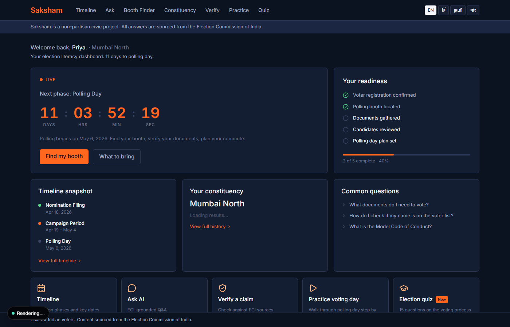
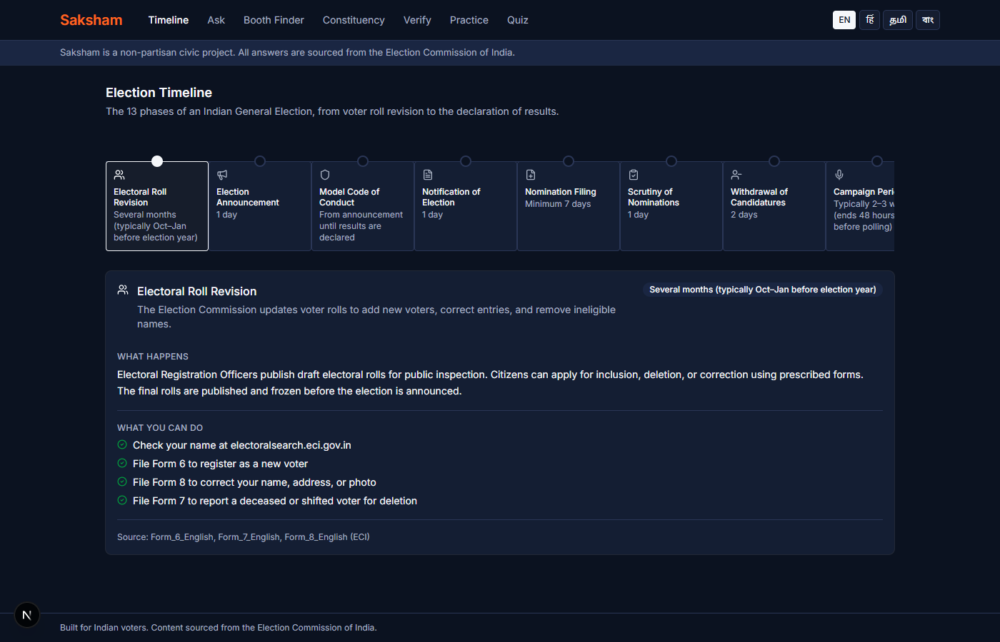
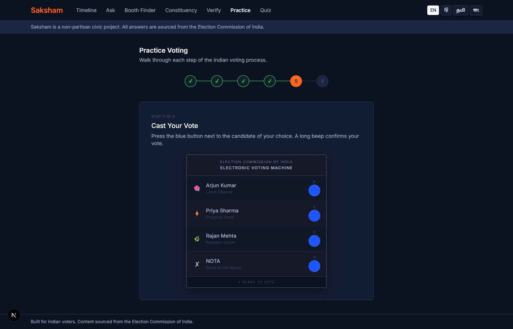
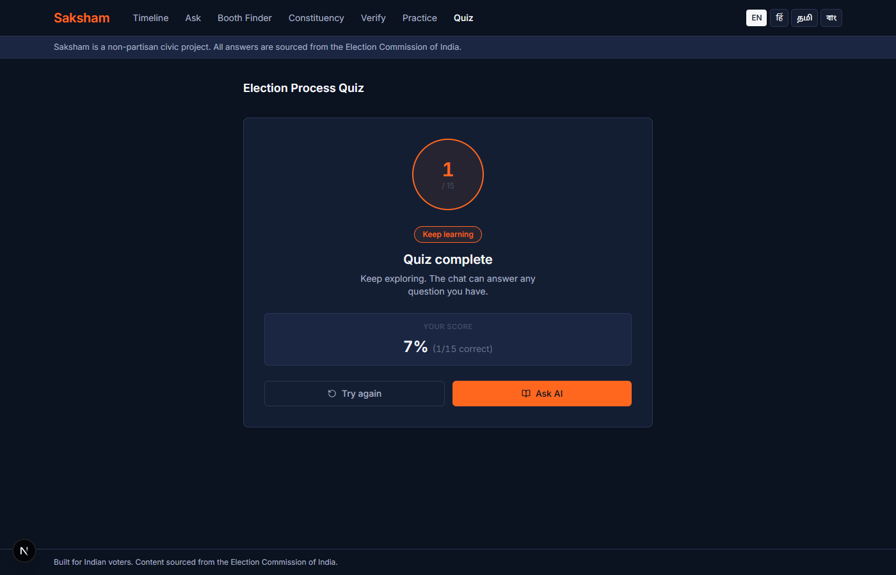

# Saksham

Voter education tool for India. Answers questions about the election process, finds polling booths, verifies claims against ECI sources, shows constituency election history, walks through polling day step by step, and tests voter knowledge with a 15-question quiz. Supports English, Hindi, Tamil, and Bengali.

A non-partisan civic project. All answers sourced from the Election Commission of India.

---

<table>
<tr>
  <td></td>
  <td></td>
</tr>
<tr>
  <td></td>
  <td></td>
</tr>
</table>

---

## Architecture


## How it works

Each message is classified by an Orchestrator and routed to one of four agents. Each agent is a Python class wrapping a Gemini call with its own system prompt, tools, and structured output. The orchestrator uses Gemini structured output (JSON mode) to classify user intent and delegate to the right agent.

- **Knowledge Agent** answers process questions using Vertex AI Search over ECI PDFs. Every response includes a citation. Falls back to Gemini if the search index returns no results.
- **Locator Agent** extracts a constituency or city name, looks up booth data from Firestore, and renders a Google Maps view.
- **Journey Agent** runs a stateful five-step onboarding flow for voters. Progress is tracked in Firestore per session.
- **Verifier Agent** checks election-process claims against ECI documents to debunk or confirm voter misinformation. Returns a verdict: TRUE, FALSE, PARTIALLY_TRUE, or UNVERIFIABLE.

Non-English input is translated to English before routing. Responses are translated back to the user's selected language before being returned.

The Practice Simulator and Quiz are front-end only and do not call the backend.

## Pages

| Page | Path | What it does |
|---|---|---|
| Dashboard | `/` | Countdown, readiness checklist, constituency snapshot |
| Chat | `/chat` | Main Q&A interface, all four agents |
| Timeline | `/timeline` | Election calendar with phase and date breakdowns |
| Booth | `/booth` | Polling booth locator with map |
| Constituency | `/constituency` | Lok Sabha results by constituency, 2004 to 2019 |
| Verify | `/verify` | Election myth-busting against ECI sources |
| Practice | `/practice` | Step-by-step simulation of polling day |
| Quiz | `/quiz` | 15-question test on the Indian election process |

## Google Cloud services

| Service | Role |
|---|---|
| Vertex AI (Gemini 2.5 Flash) | LLM for all agents and the intent classifier |
| Vertex AI Search | RAG over ECI documents with automatic source attribution |
| Cloud Run | Hosts `saksham-web` and `saksham-backend` |
| Maps Platform | Polling booth map rendering |
| Cloud Translation | Input and response translation (EN / HI / TA / BN) |
| Cloud Text-to-Speech | Hindi audio playback, Neural2 voice |
| Firestore | Session state and constituency seed data |
| BigQuery | Lok Sabha election results, 2004 to 2019 |
| Cloud Logging | Structured JSON logs with request_id and latency |

## Local development

```bash
# backend
cd apps/backend
uv sync
uv run uvicorn main:app --reload

# frontend (separate terminal)
cd apps/web
npm install
npm run dev
```

Copy `.env.example` into `apps/backend/.env.local` and `apps/web/.env.local`. Backend runs on `:8000`, web on `:3000`.

## Deploy

```bash
bash scripts/deploy.sh
```

Requires `gcloud` authenticated to a project with the necessary APIs enabled. See `docs/deployment.md` for IAM setup and first-deploy steps.

## Eval

```bash
# backend must be running
python eval/run_eval.py
```

Runs 30 Q&A pairs through the Knowledge Agent. Gemini scores each response on relevance, accuracy, and citation correctness (pass threshold: 7/10 on all three). Report written to `eval/reports/`.

## Data sources

ECI documents indexed in Vertex AI Search: `data/eci-docs/SOURCES.md`

Election results (BigQuery): sourced from the Election Commission of India. Covers Lok Sabha general elections from 2004, 2009, 2014, and 2019 across 543 constituencies. 2024 data is not included.

## License

MIT
