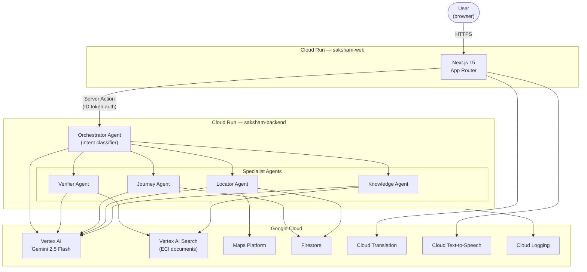

# Saksham

Multilingual, multi-agent assistant that helps Indian voters understand the election process. Every answer is grounded in Election Commission of India documents and includes a source citation.

## Architecture



## How it works

A user message hits the **Orchestrator**, which classifies intent and dispatches to the right agent:

- **Knowledge Agent** — answers factual questions using Vertex AI Search grounding over ECI PDFs. Returns citations on every response.
- **Locator Agent** — extracts a constituency or city, looks up booth coordinates from Firestore, renders a Google Maps view.
- **Journey Agent** — stateful onboarding for first-time voters. Tracks progress in Firestore per session.
- **Verifier Agent** — checks forwarded claims against ECI documents and returns a verdict (TRUE / FALSE / PARTIALLY_TRUE / UNVERIFIABLE).

Non-English input is translated to English before reaching any agent. The response is translated back to the user's selected language (EN / HI / TA / BN) before it is returned.

## Google Cloud services

| Service | Role |
|---|---|
| Vertex AI (Gemini 2.5 Flash) | LLM for all agents and the intent classifier |
| Vertex AI Search | Grounded RAG over ECI documents — citations are automatic |
| Google Agent Development Kit | Multi-agent orchestration pattern |
| Cloud Run | Hosts both `saksham-web` and `saksham-backend` |
| Maps Platform | Polling booth map rendering |
| Cloud Translation | Input and response translation (EN / HI / TA / BN) |
| Cloud Text-to-Speech | Hindi audio playback of responses |
| Firestore | Session state and constituency seed data |
| Secret Manager | Credentials in production |
| Cloud Logging | Structured JSON logs with request_id and latency |

## Data sources

ECI documents indexed in Vertex AI Search are listed in `data/eci-docs/SOURCES.md`.

## Local development

```bash
# backend
cd apps/backend
uv sync
uv run uvicorn main:app --reload

# frontend (separate terminal)
cd apps/web
npm install
npm run dev
```

Copy `.env.example` values into `apps/backend/.env.local` and `apps/web/.env.local`. Backend runs on port 8000, web on 3000.

## Deploy

```bash
bash scripts/deploy.sh
```

Requires `gcloud` CLI authenticated with a project that has the required APIs enabled. See `docs/deployment.md` for IAM bindings and first-deploy steps.

## Eval

```bash
# backend must be running
python eval/run_eval.py
```

Runs 30 Q&A pairs against the Knowledge Agent, scores with Gemini-as-judge (threshold 7/10 on relevance, accuracy, citation correctness). Report written to `eval/reports/`.
