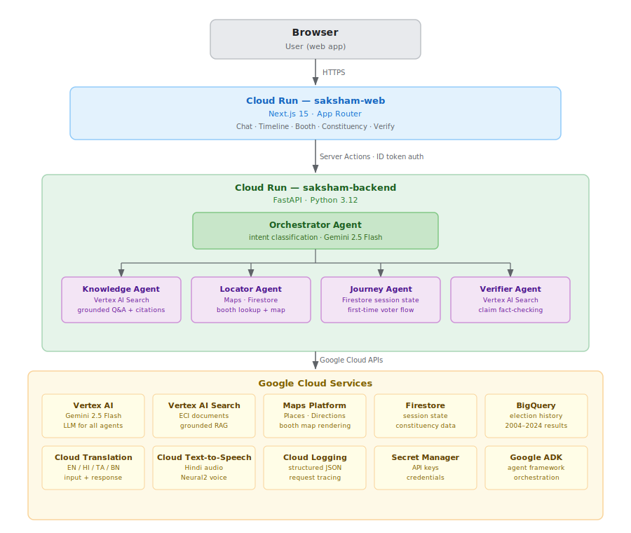

# Saksham

Voter education assistant for India. Answers questions about the election process, finds polling booths, verifies claims against ECI sources, and shows constituency-level election history. Supports English, Hindi, Tamil, and Bengali.

## Architecture



## How it works

Each message is classified by an Orchestrator and routed to one of four agents:

- **Knowledge Agent** answers process questions using Vertex AI Search over ECI PDFs. Every response includes a citation.
- **Locator Agent** extracts a constituency or city, looks up booth data from Firestore, and renders a Google Maps view.
- **Journey Agent** runs a stateful onboarding flow for first-time voters. Progress is tracked in Firestore per session.
- **Verifier Agent** checks a forwarded claim against ECI documents and returns a verdict: TRUE, FALSE, PARTIALLY_TRUE, or UNVERIFIABLE.

Non-English input is translated to English before routing. Responses are translated back to the user's selected language before being returned.

## Pages

| Page | Path | What it does |
|---|---|---|
| Chat | `/chat` | Main Q&A interface, all four agents |
| Timeline | `/timeline` | Election calendar with phase and date breakdowns |
| Booth | `/booth` | Polling booth locator with map |
| Constituency | `/constituency` | Lok Sabha results by constituency, 2004 to 2024 |
| Verify | `/verify` | Claim checker against ECI documents |

## Google Cloud services

| Service | Role |
|---|---|
| Vertex AI (Gemini 2.5 Flash) | LLM for all agents and the intent classifier |
| Vertex AI Search | RAG over ECI documents with automatic source attribution |
| Google ADK | Multi-agent orchestration |
| Cloud Run | Hosts `saksham-web` and `saksham-backend` |
| Maps Platform | Polling booth map rendering |
| Cloud Translation | Input and response translation (EN / HI / TA / BN) |
| Cloud Text-to-Speech | Hindi audio playback, Neural2 voice |
| Firestore | Session state and constituency seed data |
| BigQuery | Lok Sabha election results, 2004 to 2024 |
| Secret Manager | Credentials in production |
| Cloud Logging | Structured JSON logs with request_id and latency |

## Local development

```bash
# backend
cd apps/backend
uv sync
uv run uvicorn main:app --reload

# frontend (separate terminal)
cd apps/web
npm install
npm run dev
```

Copy `.env.example` into `apps/backend/.env.local` and `apps/web/.env.local`. Backend runs on `:8000`, web on `:3000`.

## Deploy

```bash
bash scripts/deploy.sh
```

Requires `gcloud` authenticated to a project with the necessary APIs enabled. See `docs/deployment.md` for IAM setup and first-deploy steps.

## Eval

```bash
# backend must be running
python eval/run_eval.py
```

Runs 30 Q&A pairs through the Knowledge Agent. Gemini scores each response on relevance, accuracy, and citation correctness (pass threshold: 7/10 on all three). Report written to `eval/reports/`.

## Data sources

ECI documents indexed in Vertex AI Search: `data/eci-docs/SOURCES.md`

Election results (BigQuery): sourced from the Election Commission of India. Covers all Lok Sabha general elections from 2004 to 2024 across 543 constituencies.

## License

MIT
